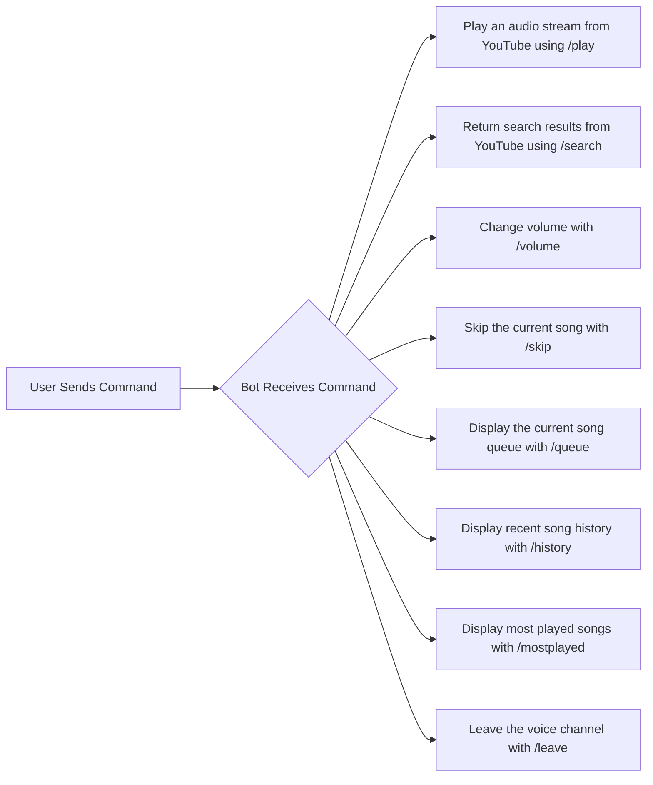

#    Discord Music Bot   

- A non-intrusive Discord music bot for self-hosting.
- Very easy to setup!

## Table of Contents

- [Latest Updates ✨](#latest-updates-)
- [Prerequisites 🚧](#prerequisites-)
- [Installation 📝](#installation-)
  - [Docker 🐳](#docker-)
  - [Non-Docker 💪](#non-docker-)
- [Support 📝](#support-)
- [Screenshots 📸](#screenshots-)
  
## Latest Updates

- **Release v0.2**
- **Slash Commands:**
  - `/play [url]` - Play an audio stream from YouTube by URL
  - `/search [keyword]` - Return and display search results from YouTube by keywords
  - `/volume [number]` - Change the volume from 0 - 100
  - `/skip` - Skip the current song
  - `/queue` - Display current song queue
  - `/history` - Display recent song history
  - `/mostplayed` - Display most played songs
  - `/leave` - Leave voice

## Prerequisites (Included in Releases)
- **YTDLP**
- **FFMPEG**
- **libsodium.dll & opus.dll**

> **Note:** If building for Linux, make sure to get the proper ytdlp to include in your build folder.

## Installation 📝
1. **Extract content in Release.zip**
2. **Run DiscordModBot once to generate** the `config.json`.
3. **Set your Discord API key** in `config.json`.
4. **Set your Guild (Server) ID** in `config.json` to register slash commands.
5. **Run the bot!**

## Bot Workflow 🌐

Support 📝

If you encounter any issues with the bot, please consult the documentation or search online for solutions.
Screenshots 📸
 
