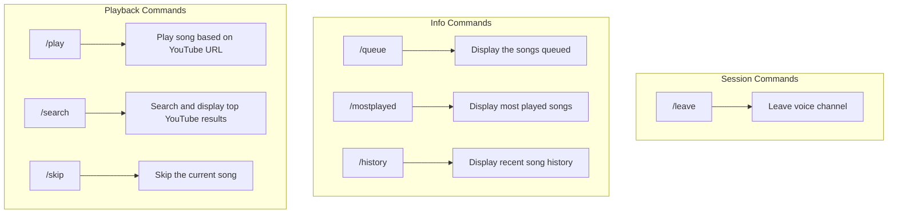

#    Discord Music Bot   

- A non-intrusive Discord Music Bot for simple self-hosting.
- Very easy to setup!

## ✨ Latest Updates
- **Release v0.3**
  
## 🚧 Prerequisites (Included in Releases (Exception: Ffmpeg))
- **Yt-dlp**
- **Ffmpeg**
- **libsodium.dll & opus.dll**

> **Note:** Linux/Window Builds - Ensure to include libsodium, opus, and yt-dlp program in your build folder. (Install ffmpeg normally, so you can use it in the terminal from anywhere)

## 🛠 Installation
1. **Extract content in publish.zip**
2. **Download libsodium.dll, opus.dll, and yt-dlp from github releases, drag those in the extracted publish folder**
3. **Run DiscordModBot once to generate** the `config.json`.
4. **Set your Discord API key** in `config.json`.
5. **Set your Guild (Server) ID** in `config.json` to register slash commands.
6. **Run the bot!**

## 🌐 Bot Commands Workflow

## 📝 Support 

If you encounter any issues with the bot, please consult the documentation or search online for solutions.

## 📸 Screenshots 
 
